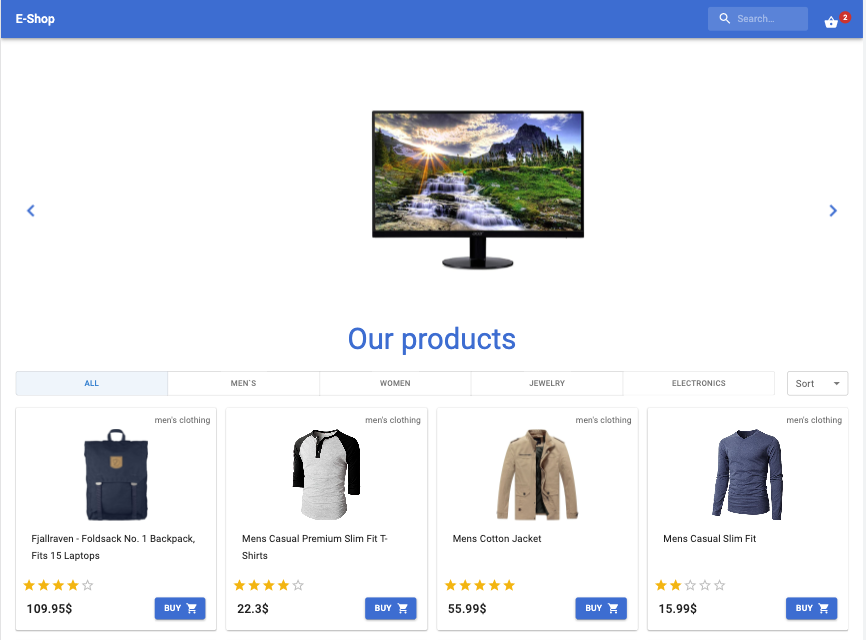
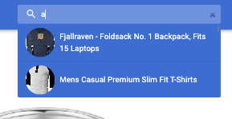
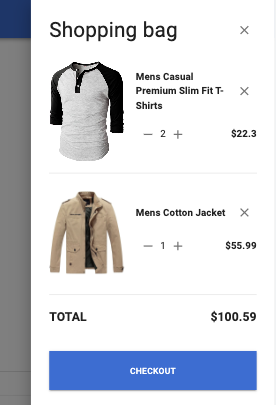
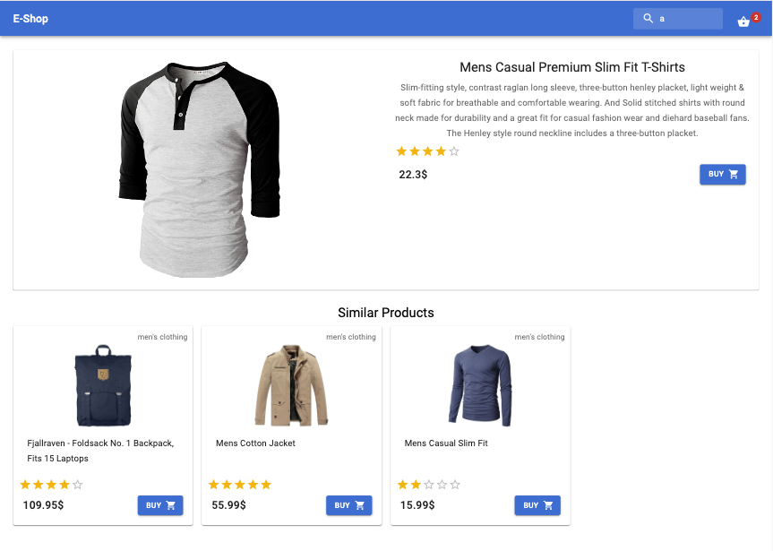
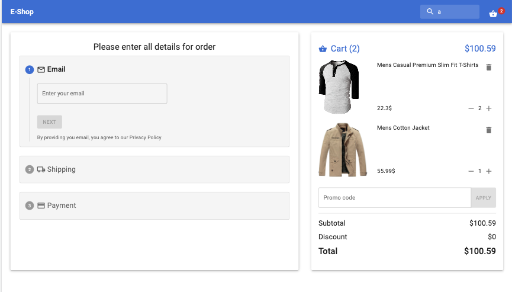

# React App "E-shop"

Wellcome! 🚀

This is my study react-project ecommerce shop

## About

The main page consists of a slider (react-responsive-carousel), a list of products that can be sorted and filtered depending on the need.

You can also use the search field at the top to quickly find a product.

By clicking on the cart, a list of products that the user has added to the cart opens.

The product page consists of complete information about the product, as well as a list of similar products of the same category

The ordering page consists of a list of the products that the user is ordering, and if necessary, he can change the number of products or delete an extra one and a block with information on the order.
Registration is completed in three stages, the user needs to enter the mail, delivery address and pay for the order.
All fields use validation

---

> All information is taken from FakeStore API. 
Using react libraries like redux, redux-thunk, redux-persist, router, react-query, hooks, react-hook-form with yup validation, axios etc.
All styles are made by Material-UI
---
